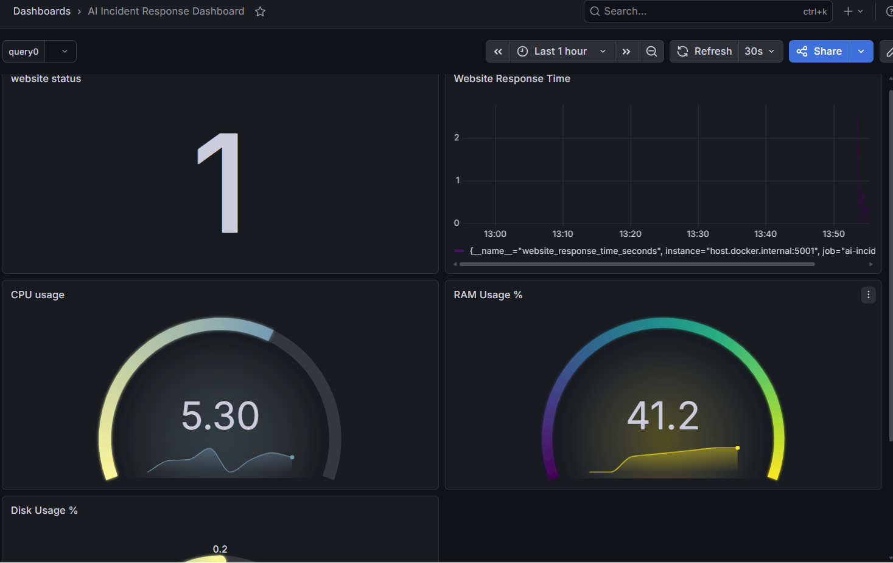
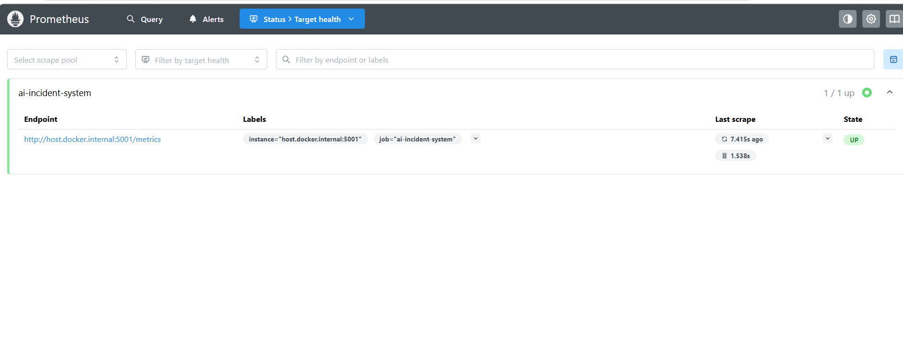
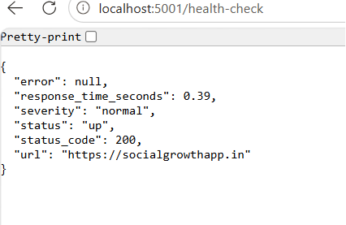
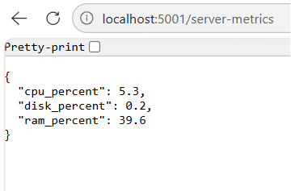
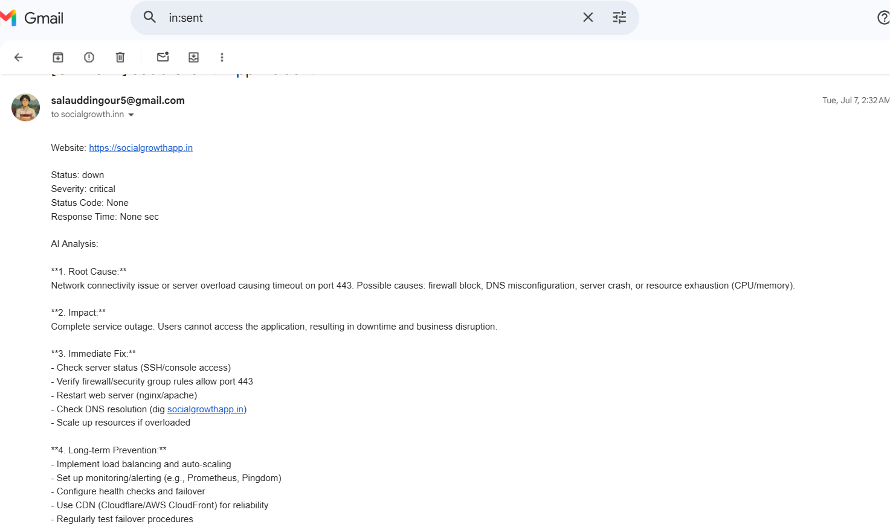

# AI Incident Response Platform

## Overview

AI Incident Response Platform is a DevOps monitoring solution that continuously monitors production websites, detects incidents, performs AI-based analysis, sends automated email alerts, and visualizes infrastructure metrics using Prometheus and Grafana.

---

## Key Features

- Website Health Monitoring
- Response Time Monitoring
- CPU, RAM and Disk Monitoring
- SSL Certificate Monitoring
- AI-Based Incident Analysis
- Automated Email Alerts
- Auto-Healing Workflow
- Prometheus Metrics Integration
- Grafana Dashboard
- APScheduler Background Monitoring
- SQLite Incident Storage

---

## Technology Stack

- Python
- Flask
- SQLite
- APScheduler
- Prometheus
- Grafana
- Docker
- OpenRouter API
- DeepSeek AI
- SMTP
- Requests
- Psutil

---

## Architecture

Website → Flask Application → Incident Workflow → AI Analysis → Email Alerts → SQLite Database → Prometheus → Grafana Dashboard

---

## Project Structure

```
AI-Incident-Response-Platform
│
├── app
│   ├── routes
│   ├── services
│   ├── database
│   ├── settings.py
│   ├── config.py
│   ├── main.py
│   └── requirements.txt
│
├── docker
├── monitoring
├── scripts
├── data
├── docker-compose.yml
├── .gitignore
└── README.md
```

---

## Installation

Clone the repository

```bash
git clone https://github.com/Salauddinnnn/AI-Incident-Response-Platform.git
```

Install dependencies

```bash
pip install -r app/requirements.txt
```

Run the application

```bash
python app/main.py
```

---

## Dashboard

The project exposes monitoring metrics through Prometheus and visualizes them using Grafana.

Dashboard includes:

- Website Status
- Response Time
- CPU Usage
- RAM Usage
- Disk Usage

---

## Future Improvements

- Multi-Website Monitoring
- Slack & Microsoft Teams Alerts
- AWS Cloud Deployment
- Kubernetes Monitoring
- User Authentication
- Custom Web Dashboard

---

## Author

**Salauddin Gour**

GitHub: https://github.com/Salauddinnnn
## Screenshots

### Grafana Dashboard



### Prometheus Targets



### Health Check API



### Server Metrics



### SSL Monitoring


### Email Alert

